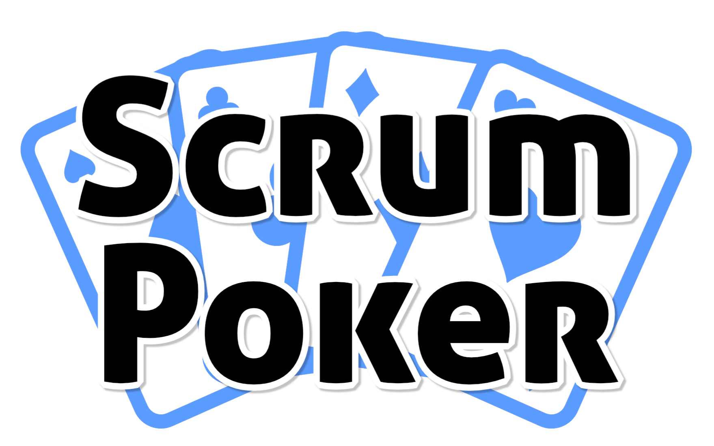

# Scrum Poker

A simple Scrumpoker Web App, based on [Vue 3](https://vuejs.org), [Express](https://expressjs.com) and [Socket.io](https://socket.io)

It lets you create a virtual room for your team to sit on the table and play a few rounds of Scrum/Planning Poker. See in realtime who has already voted and reveal all cards for everyone in the room at the same time. No ads, no limitations.

## Demo
Feel free to take a look or just use it straight away on:   
[poker.page6.de](https://poker.page6.de)


## Installation:

##### Development

Frontend: 
```shell
cd frontend
npm install
npm run dev
```


Backend: 
```shell
cd backend
npm install
npm run dev
```

Server runs at localhost:3000, Frontend is served in Dev Mode at loclahost:8080


##### Building

```shell
cd frontend
npm run build
cd ../backend
npm run start
```

The built frontend is build into backend directory and directly served via the Backend Server at port 3000 by default. 


## Issues
Please report any issues directly on GitHub:
[Issue Board](https://github.com/page6de/poker/issues)


### Credits:
- Icons from [SVG Repo](https://www.svgrepo.com)


Go, Team Content Factory!
